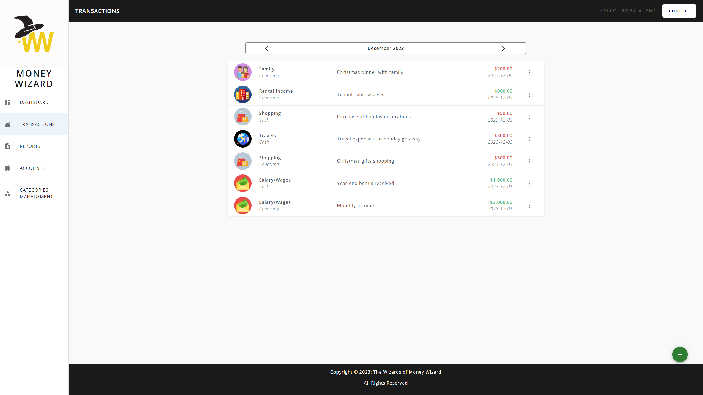
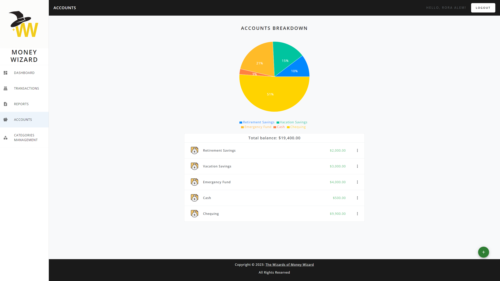
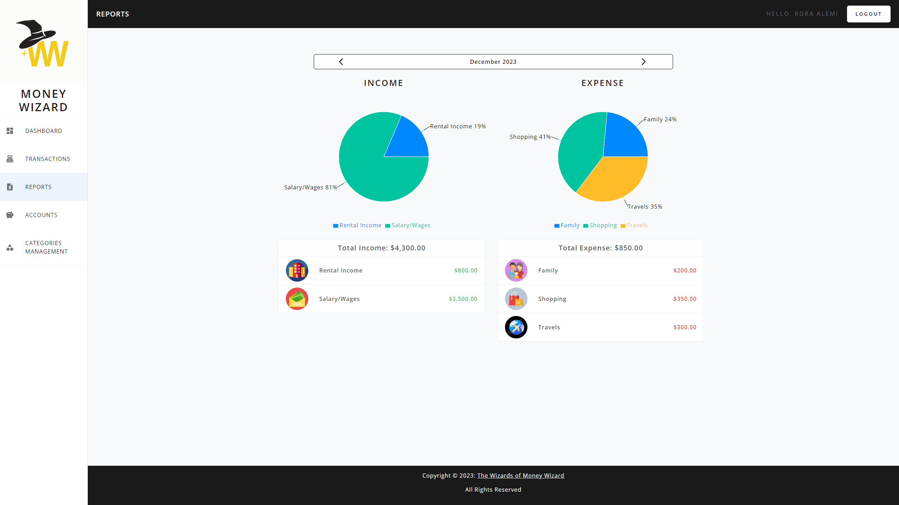

# WELCOME TO ✨MONEY WIZARD✨!

Do you need help to better manage your monthly income/expense? This is the solution you are looking for!

## Main features
- Current month summary dashboard
- Transactions logging (Income/Expense/Transfer)
- Adding new wallet account
- Detail report by month
- Customized transaction category
- Create monthly budget - <i>in progress</i>
- Recurring transaction - <i>in progress</i>

## Tech stack
- ReactJS
- ExpressJS
- PostgreSQL
- React bootstrap
- MaterialUI
- Recharts

## Screenshots
#### Transaction page

#### Account page

#### Report page


## Setup
Install dependencies with `npm install` in each respective `/frontend` and `/backend` folder
#### [FRONTEND] Running Webpack Development Server
```
cd frontend
npm start
```
#### [BACKEND] Running Backend Server
Read `backend/README.md` for futher setup detail
```
cd backend
npm run reset
npm start
```